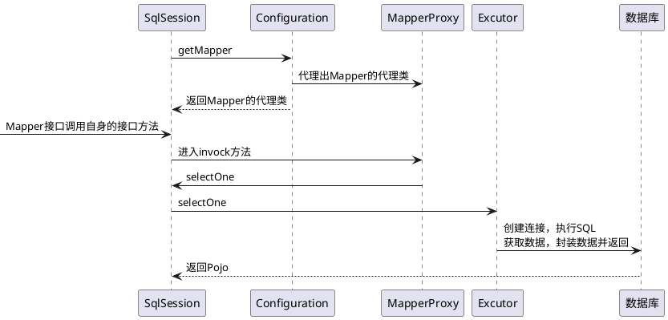

# 模拟MyBatis
目的：更好的理解MyBatis的原理

## MyBatis 编程式写法
##### MyBatis结构简图


```java
    public class MyBatisTest
    {
        public static SqlSession getSqlSession() throws FileNotFoundException
        {
            //配置文件
            InputStream configFile = new FileInputStream("D:\\File\\Code\\Java\\git\\other\\XychBatis\\src\\main\\resource\\config\\mybatis-config.xml");
            SqlSessionFactory sqlSessionFactory = new SqlSessionFactoryBuilder().build(configFile);
            //加载配置文件得到SqlSessionFactory
            return sqlSessionFactory.openSession();
        }

        public static void main(String[] args) throws Exception
        {
            UserMapper userMapper = getSqlSession().getMapper(UserMapper.class);
            User user = userMapper.selectOne("1");
            System.out.println(user);
        }
    }
```

## XychBatis-version1.0

实现`MyBatisTest.main`方法中的三行代码。

``` java
public class XychBatisTest
{
    public static void main(String[] args)
    {
        SqlSession sqlSession = new SqlSession(new Configuration(), new SimpleExcutor());
        UserMapper userMapper = sqlSession.getMapper(UserMapper.class);
        User user = userMapper.selectOne("1");
        System.out.println(user);
    }
}
```

#### v1.0 类图


#### v1.0时序图




